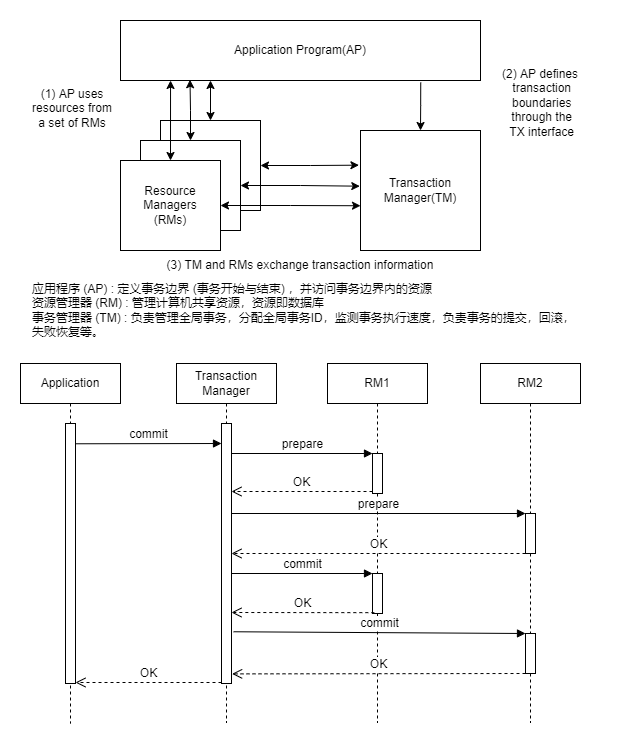
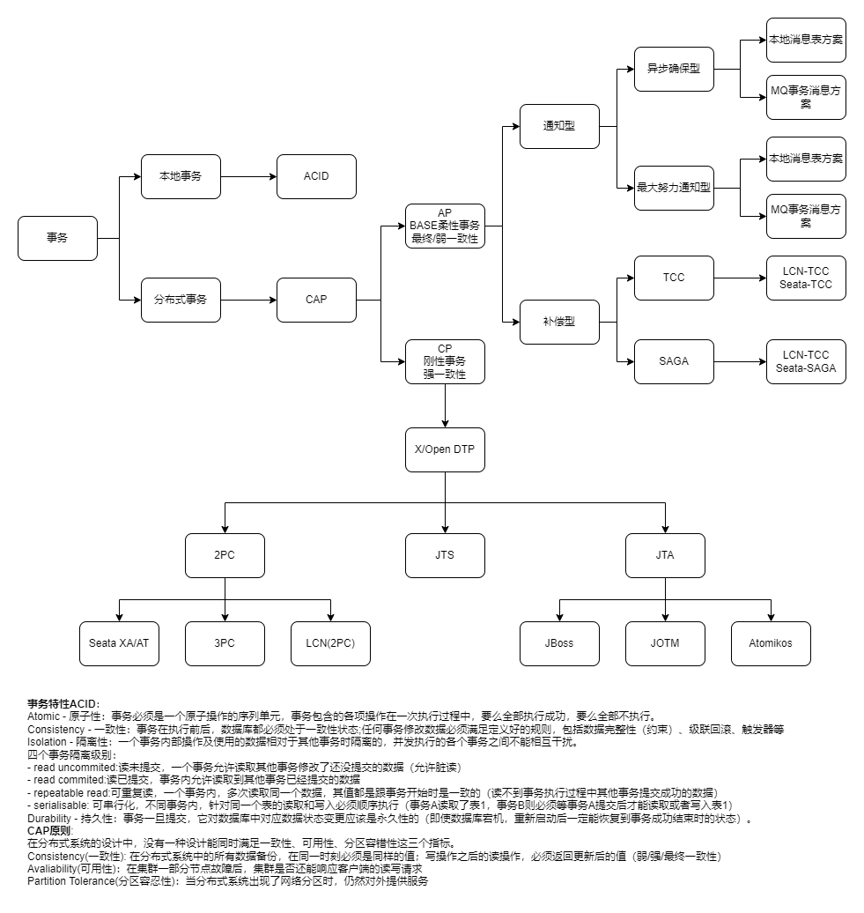
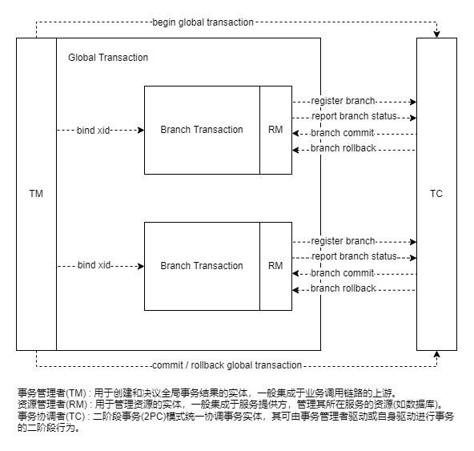
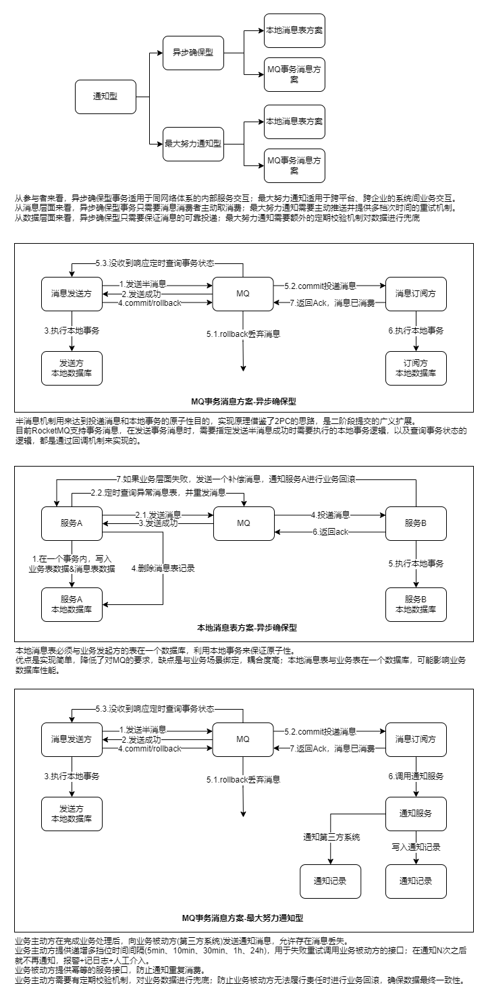

## zakiis-dtp-starter

### Introduction

A distributed transaction processor model implementation. DTP relying on XA - The X/Open Distributed Transaction Processing (DTP) architecture defines a standard architecture or interface that enables multiple application programs (APs) to share resources provided by multiple, and possibly different, resource managers (RMs). It coordinates the work between APs and RMs into global transactions.

There are many ways to implement the DTP, each pattern focus on the specified situations, you need choose one that is suite for your business.

### Domain Model

### Message-based Transaction

The core concept of the message-based distributed transaction mode is to inform other transaction participants of its own execution status through the message system.

There are two main solutions for the message-based distributed transaction mode:

- A solution based on transactional messages

- A solution based on local messages

**Transactional-Message-Based Distributed Transactions**

Transactional messages differ from normal messages in that after a transactional message is successfully sent, it enters the prepared state and cannot be consumed by subscribers. The downstream subscribers can perceive this message only after the state of the transactional message changes to consumable.

**Local-Message-Based Distributed Transactions**

Not all MQ systems support transactional messages. The core concept of this mode is that the transaction initiator maintains a local message table. Business and local message table operations are executed in the same local transaction. If the service is successfully executed, a message with the "to be sent" state is also recorded in the local message table. The system starts a scheduled task to regularly scan the local message table for messages that are in the "to be sent" state and sends them to MQ. If the sending fails or times out, the message will be resent until it is sent successfully. Then, the task will delete the state record from the local message table. The subsequent consumption and subscription process is similar to that of the transactional message mode.

### Compensating Transaction

When you use an eventually consistent operation that consists of a series of steps, the Compensating Transaction pattern can be useful. Specifically, if one or more of the steps fail, you can use the Compensating Transaction pattern to undo the work that the steps performed. Typically, you find operations that follow the eventual consistency model in cloud-hosted applications that implement complex business processes and workflows.

